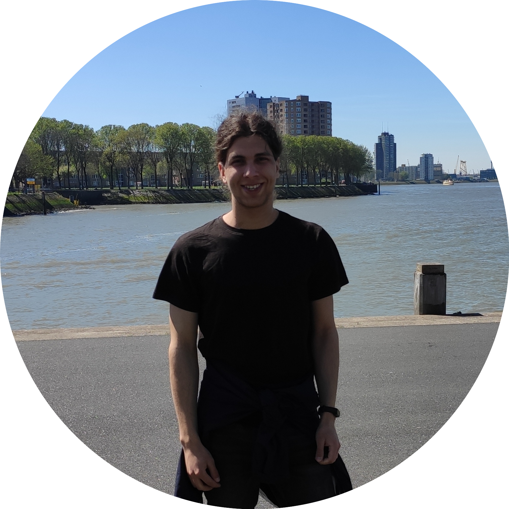

  
  

 
  

  
  

<h1>
  Hi, I'm Michal
  
</h1>

### :man_technologist: About Me :
I am a 5th semester Computer Science student based in Poland :mortar_board:
- :telescope: I’m interested in Software Engineering, Agile Methodologies (Scrum, Kanban) and Space Exploration.

- :seedling: My current university major language is C++

- :mailbox:How to reach me: **smaluchmichal@gmail.com**

---

### :hammer_and_wrench: Languages and Tools :

  &nbsp;
  &nbsp;
  &nbsp;
  &nbsp;
  &nbsp;
  &nbsp;

<h1>
 
  Projects I'm proud of :wrench:
</h1>
<h3>
<i>(Latest first)</i>
</h3>

###  :collision: C++ Projects :

- 🎮: Voxel engine implementation using OpenGL: [REPO](https://github.com/drago20013/CP4_Blocky) | [README](https://github.com/drago20013/CP4_Blocky/blob/main/README.md)
- 🗃️: Custom ***Binary Search Tree Container*** implementation: [REPO](https://github.com/drago20013/BinarySearchTree) | [README](https://github.com/drago20013/BinarySearchTree/blob/main/README.md)
- 🧰: To-Do list in terminal: [REPO](https://github.com/drago20013/Todo-List) | [README](https://github.com/drago20013/Todo-List/blob/main/README.md)
